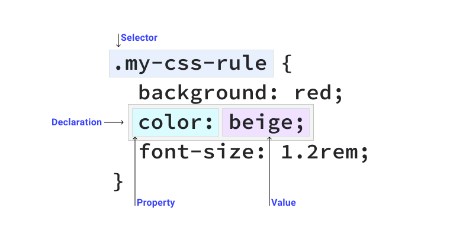

# 选择器
>原文地址：https://web.dev/learn/css/selectors/
>
> 想要把 CSS 应用在某个元素上，那首选你得选中这个元素。CSS 为你提供了很多种方法，你可以在这个模块中去探索。

这里有一段文本，如果想让文章的第一段变大变红，应该怎么做？

```html
<article>
  <p>I want to be red and larger than the other text.</p>
  <p>I want to be normal sized and the default color.</p>
</article>
```

你可以使用CSS选择器找到这一段，然后应用CSS规则，像这样：

```css
article p:first-of-type {
  color: red;
  font-size: 1.5em;
}
```

CSS提供了非常多的这一类选项，有非常简单的，也有非常复杂的，用来解决这种情况。

https://codepen.io/web-dot-dev/pen/XWprGYz

## CSS规则的组成

要想了解选择器的工作方式和它们在CSS中的作用，那么理解CSS规则的组成原理就重要了。CSS规则是一段包含一个或多个选择器和一个或多个声明的代码。



在这段CSS代码中，选择器`.my-css-rule`表示找到所有类名叫`my-css-rule`的元素。在代码大括号里面有三个声明。声明是一个键值对（即一个属性对应一个值），应用在被选择器匹配的元素上。CSS规则可以有任意多个选择器和声明。

## 简单选择器

大多数直接以HTML元素，类，ID 或 HTML额外属性为选择器的为简单选择器。

>译者注：
>比如 `h1`、`.my-class`、`#myId`、`p[data-hellp]` 这些选择器 

## 通配选择器

一个[通配选择器](https://developer.mozilla.org/en-US/docs/Web/CSS/Universal_selectors)，也被称为通配符，可匹配任意元素。

```css
* {
  color: hotpink;
}
```

上面的代码让页面上所有元素的字体颜色是亮粉色。

## 类型选择器

[类型选择器](https://developer.mozilla.org/en-US/docs/Web/CSS/Type_selectors)直接匹配HTML元素。

```css
section {
  padding: 2em;
}
```

上面的代码让所有`section`元素都有`2em`的`内边距`

## 类选择器

一个HTML元素可以有一个或多个`class`属性。[类选择器](https://developer.mozilla.org/en-US/docs/Web/CSS/Class_selectors)匹配那些加上了这些类的元素。

```html
<div class="my-class"></div>
<button class="my-class"></button>
<p class="my-class"></p>
```

任何元素添加了这个类名，那么它的字体颜色就会是红色：

```css
.my-class {
  color: red;
}
```

注意 `.` 点只出现在CSS中，而不在HTML。这是因为 `.` 点字符在CSS语言中表示匹配具有该类属性的元素。这是CSS的常见模式，可以使用一些特殊的单词或字符来表达你要定义的选择器的名称。

一个HTML元素只要有一个`.my-class`类，那么就会匹配到对应的CSS规则，即使元素还有多个其他类。比如：

```html
<div class="my-class another-class some-other-class"></div>
```

这是因为CSS是查找`class`属性是不是包含了定义的类，而不是完全匹配该类。

>你几乎可以定义任何类属性值。只有一件事可能会让你失望，就是你不能以数字开头定义类或ID的名称，比如 `1element`。你可以[在规范中](https://www.w3.org/TR/CSS21/syndata.html#characters)发现更多。